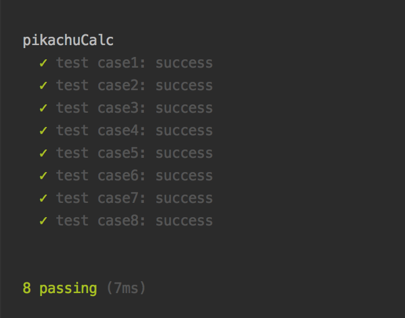

# Pocketmongo

## 폴더 구조
```
pocketmongo // 최상위 폴더
│
├── screenshot // README.md에 사용되는 이미지 폴더
│
├── test // 테스트 코드 폴더
│
├── package.json // 의존 모듈 관리 파일
│
├── package-lock.json // 의존 모듈 종속성 고정 파일
│
├── README.md // 알고리즘 과제 가이드 파일
│
└── solution.js // 포켓몬고 알고리즘 과제 해결 파일
```

## 해결 방법
1. 사탕을 사용해 피카츄를 진화시키고, 그에 대한 보상으로 XP와 사탕을 받는 행위가 반복된다고 판단했습니다.
2. 위의 반복하는 동작을 코드로 구현하기 위해 재귀함수를 사용했습니다.
3. 아래 두 가지 조건은 반복문을 멈추기 위한 종료 조건입니다.   
    - 진화할 수 있는 피카츄가 없는 경우
    - 피카츄를 사탕으로 교환했을 때 진화할 수 있는 피카츄가 없는 경우
     
## 테스트
Mocha라는 테스트 프레임워크를 사용했으며, 아래의 명령어를 입력하면 테스트 결과를 확인할 수 있습니다. 

```
npm install
```

```
npm run test
```

