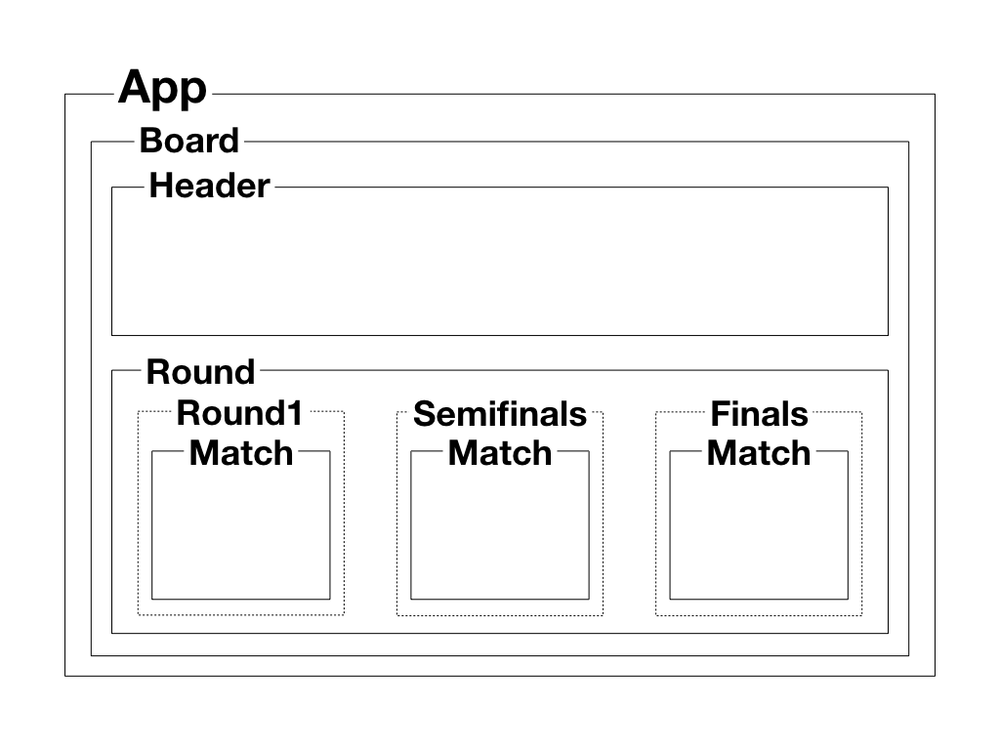

# Tournament
## 폴더 구조
```
tournament // 최상위 폴더
    │
    ├── public // entry html 파일을 포함하고 있는 폴더
    │
    ├── screenshot // README.md에 사용되는 이미지 폴더
    │
    ├── src // 소스 코드 폴더
    │
    ├── babel.config.js // babel 설정 파일
    │
    ├── package.json // 의존 모듈 관리 파일
    │
    ├── package-lock.json // 의존 모듈 종속성 고정 파일
    │
    └── README.md // 토너먼트 대진표 과제 가이드 파일
```

## 컴포넌트 구조
- 실선은 컴포넌트를 나타내며, 점선은 개념상의 구분을 나타냅니다.


## 보완해야 할 점
- 다음 라운드를 이어주는 선 추가하기
- 테스트 추가하기

## 실행 방법
### 프로젝트 실행에 필요한 모듈 설치
```
npm install
```

### 실행하기 - 개발 모드
```
npm run serve
```

### 실행하기 - 배포 모드
```
npm run build
```

### 린트 실행하기
```
npm run lint
```